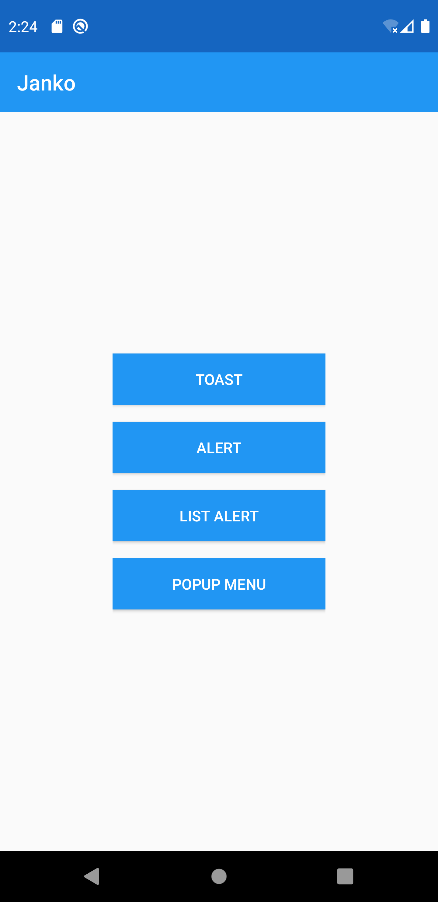

# Janko

A Kotlin DSL native Layout and native UI tools library with Androidx. Similar to Anko Layouts in [Kotlin/Anko](https://github.com/Kotlin/Anko)

## Usage

### DSL Layout

Layout Structure

```kotlin
SomeLayout(ctx).ui {
    someLayoutProperty1 = value1
    someLayoutFunction2(value2)

    SomeView(ctx).ui {
        someViewProperty1 = value1
        someViewFunction2(value2)
    }.lparams {
        // layout params in SomeView
    }.into(this)
    
    SomeOtherLayout(ctx).ui {
        // params in SomeOtherLayout
        // other layouts or views
    }.lparams {
        // layout params in SomeOtherLayout
    }.into(this)

    // other layouts or views

}.lparams {
    // layout params in SomeLayout
}
```

Equivalent to native code:

```kotlin
val someLayout = SomeLayout(ctx)
someLayout.someLayoutProperty1 = value1
someLayout.someLayoutFunction2(value2)

val someView = SomeView(ctx)
someView.someViewProperty1 = value1
someView.someViewFunction2(value2)
val someViewLayoutParams = LinearLayoutCompat.LayoutParams(ViewGroup.LayoutParams.WRAP_CONTENT, ViewGroup.LayoutParams.WRAP_CONTENT)
// someViewLayoutParams config
someLayout.addView(someView)

val someOtherLayout = SomeOtherLayout(ctx)
// config params in someOtherLayout
val someOtherLayoutParams = SomeOtherLayoutCompat.LayoutParams(ViewGroup.LayoutParams.WRAP_CONTENT, ViewGroup.LayoutParams.WRAP_CONTENT)
// someOtherLayoutParams config
someLayout.addView(someOtherLayout)

val someLayoutParams = SomeLayoutCompat.LayoutParams(ViewGroup.LayoutParams.WRAP_CONTENT, ViewGroup.LayoutParams.WRAP_CONTENT)
// someLayoutParams config
someLayout.layoutParams = someLayoutParams

// someLayout config finished
```

Add to activity

```kotlin
// 1. Create UI class
class SomeUI: UI {
    override fun createView(ctx: Context): View {
        // SomeLayout config 
        return someLayout
    }
}

```

```kotlin
// 2. setContentView in activity onCreate()
class SomeActivity : AppCompatActivity() {
    override fun onCreate(savedInstanceState: Bundle?) {
        super.onCreate(savedInstanceState)
        SomeUI().setContentView(this)   // Equivalent to: this.setContentView(view)
        // other config, eg: setSupportActionBar()
    }
}

```

Layout Structure Sample



```kotlin
class MainActivity : AppCompatActivity() {
    override fun onCreate(savedInstanceState: Bundle?) {
        super.onCreate(savedInstanceState)
        MainUI().setContentView(this)   // Equivalent to: this.setContentView(view)
        //...
    }
}

class MainUI: UI {
    override fun createView(ctx: Context): View {
        return with(ctx) {
            LinearLayoutCompat(ctx).ui {
                orientation = LinearLayoutCompat.VERTICAL
                Toolbar(ctx).ui {
                    id = R.id.toolbar
                    title = "Janko"
                    setTitleTextColor(getColor(R.color.white))
                    setBackgroundColor(getColor(R.color.colorPrimary))
                }.lparams {
                    width = matchParent
                    height = wrapContent
                }.into(this)

                LinearLayoutCompat(ctx).ui {
                    orientation = LinearLayoutCompat.VERTICAL
                    gravity = Gravity.CENTER

                    Button(ctx).ui {
                        text = "Toast"
                        setTextColor(getColor(R.color.white))
                        setBackgroundColor(getColor(R.color.colorPrimary))

                        onClick {
                            toast("This is a toast")
                        }
                    }.lparams {
                        width = dip(200)
                        height = wrapContent
                        gravity = Gravity.CENTER
                        topMargin = dip(8)
                        bottomMargin = dip(8)
                    }.into(this)
                    
                    //... other layouts or views, DON'T FORGET using .into(this) to add the View to ViewGroup.

                }.lparams {
                    width = wrapContent
                    height = matchParent
                    gravity = Gravity.CENTER
                }.into(this)
            }.lparams {
                width = matchParent
                height = matchParent
            }
        }
    }
}
```

### Useful Tools
```kotlin
// Context or View
dip(px) // Convert pixel to density pixel
matchParent // Equivalent to: ViewGroup.LayoutParams.MATCH_PARENT
wrapContent // Equivalent to: ViewGroup.LayoutParams.WRAP_CONTENT
```
```kotlin
// Context
toast(text) // Equivalent to: Toast.makeText(context, text, duration).show()
copy(text) // Copy text to clipboard
intentFor<SomeActivity>() // create Intent. Use startActivity() easily

// Context, by Androidx
alert {} // Show alert dialog
listAlert(items) {} // Show list alert dialog
```
```kotlin
// View
someView.popupMenu() // Make popupMenu
onClick() // Listen onClick event
onLongClick() // Listen onLongClick event
onContextClick() // Listen onContextClick event
```

## Independence

Just use base(not include any androidx independence)
```gradle
    janko-base
```

Use appcampat
```gradle
    janko-appcompat
```

Use androidx individual layout or view package
```gradle
     janko-androidx-layout
     janko-androidx-view
```

## License

**Janko** is under MIT license. See the [LICENSE](LICENSE) file for more info.


